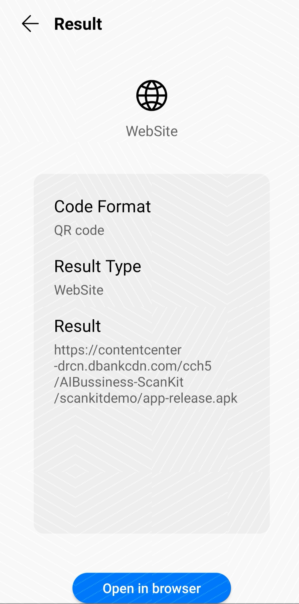

# 华为统一扫码服务Android示例代码

中文 | [English](README.md)

## 目录

 * [简介](#简介)
 * [开发准备](#开发准备)
 * [环境要求](#环境要求)
 * [示例代码](#示例代码)
 * [运行结果](#运行结果)
 * [授权许可](#授权许可)

## 简介
示例代码显示了如何使用HMS扫描套件的代码扫描功能来帮助开发人员在应用程序中快速构建代码扫描功能。

该示例也可以通过HMS Toolkit快速启动运行，且支持各Kit一站式集成，并提供远程真机免费调测等功能。了解更多信息，请参考[HMS Toolkit文档](https://developer.huawei.com/consumer/cn/doc/development/Tools-Guides/getting-started-0000001077381096?ha_source=hms1) 。

## 开发准备
1)创建app应用，并配置AppGallery Connect。
见详情:[HUWEI Scan Development Preparation](https://developer.huawei.com/consumer/cn/doc/development/HMSCore-Guides/android-config-agc-0000001050043955?ha_source=hms1)

2)添加当前应用的AppGallery Connect配置文件

3)配置HMS Core SDK的Maven仓地址

## 环境要求
使用Android Studio3.0及以上和JDK1.8.211及以上进行编译
准备了运行EMUI 3.0或更高版本，适应HMS APK 4.0.0.200或更高版本的设备
	
## 示例代码
演示提供了四种模式，以适应不同情况下的代码扫描能力。

1)Default View

该应用程序直接调用HUAWEI Scan Kit的扫码活动，并通过异步回调API获取扫描结果。 可以使用设备相机或通过导入的图像扫描条形码。

代码位置:example/scankitdemo/MainActivity.java

2)Customized View

该应用程序直接创建RemoteView，并通过异步回调API获取扫描结果。 可以使用设备相机或通过导入的图像扫描条形码。

代码位置:example/scankitdemo/DefinedActivity.java

3)Bitmap API

该应用程序直接通过位图API传递位图，并通过API获得扫描结果。 在您的应用中，您可以调用相机API或导入本地图像以获得位图，然后调用HUAWEI Scan Kit的位图API来解码位图。

代码位置:example/scankitdemo/CommonActivity.java example/scankitdemo/CommonHandler.java

4)MultiProcessor API

该应用程序使用与HUAWEI ML Kit相同的技术，通过MultiProcessor API传递帧数据以进行解码，并检测条形码以及诸如面部。

代码位置:example/scankitdemo/CommonActivity.java example/scankitdemo/CommonHandler.java
	
5)Generate Code API

该应用程序允许您生成条形码。

代码位置:example/scankitdemo/GenerateCodeActivity.java

## 运行结果

## 技术支持
如果您对HMS Core还处于评估阶段，可在[Reddit社区](https://www.reddit.com/r/HuaweiDevelopers/)获取关于HMS Core的最新讯息，并与其他开发者交流见解。

如果您对使用HMS示例代码有疑问，请尝试：
- 开发过程遇到问题上[Stack Overflow](https://stackoverflow.com/questions/tagged/huawei-mobile-services?tab=Votes)，在`huawei-mobile-services`标签下提问，有华为研发专家在线一对一解决您的问题。
- 到[华为开发者论坛](https://developer.huawei.com/consumer/cn/forum/blockdisplay?fid=18?ha_source=hms1) HMS Core板块与其他开发者进行交流。

如果您在尝试示例代码中遇到问题，请向仓库提交[issue](https://github.com/HMS-Core/hms-scan-demo/issues)，也欢迎您提交[Pull Request](https://github.com/HMS-Core/hms-scan-demo/pulls)。

##  授权许可
华为统一扫码服务示例代码经过[Apache License 2.0](http://www.apache.org/licenses/LICENSE-2.0)授权许可。

